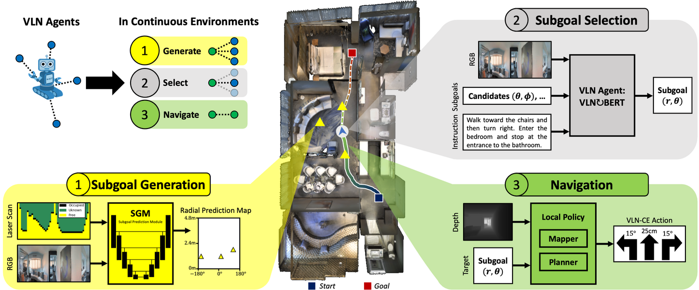

# Sim2Sim-VLNCE

Official implementation of the **ECCV 2022 Oral** paper:
**Sim-2-Sim Transfer for Vision-and-Language Navigation in Continuous Environments**

[Jacob Krantz](https://jacobkrantz.github.io/) and [Stefan Lee](http://web.engr.oregonstate.edu/~leestef/)

[[Project Page](https://jacobkrantz.github.io/sim-2-sim)] [[Paper](https://arxiv.org/abs/2204.09667)]

<p align="center">
  
</p>

## Setup

This project is modified from the [VLN-CE](https://github.com/jacobkrantz/VLN-CE) repository starting from [this commit](https://github.com/jacobkrantz/VLN-CE/tree/4ef91c0501862026e91a6d7177e515cb043575a4).

1. Initialize the project

```bash
git clone --recurse-submodules git@github.com:jacobkrantz/Sim2Sim-VLNCE.git
cd Sim2Sim-VLNCE

conda env create -f environment.yml
conda activate sim2sim
```

2. Install the latest version of [Matterport3DSimulator](https://github.com/peteanderson80/Matterport3DSimulator)

If you do not want to run experiments with known subgoal candidates, you can skip this install and remove code references to `MatterSim`.

3. Download the Matterport3D scene meshes

```bash
# run with python 2.7
python download_mp.py --task habitat -o data/scene_datasets/mp3d/
# Extract to: ./data/scene_datasets/mp3d/{scene}/{scene}.glb
```

`download_mp.py` must be obtained from the Matterport3D [project webpage](https://niessner.github.io/Matterport/).

4. Download the Room-to-Room episodes in VLN-CE format ([link](https://drive.google.com/file/d/1T9SjqZWyR2PCLSXYkFckfDeIs6Un0Rjm/view))

```bash
gdown https://drive.google.com/uc?id=1T9SjqZWyR2PCLSXYkFckfDeIs6Un0Rjm
# Extract to: ./data/datasets/R2R_VLNCE_v1-3/{split}/{split}.json.gz
```

5. Download the ResNet image encoder

```bash
./scripts/download_caffe_models.sh
# this populates ./data/caffe_models/
```

6. Download the MP3D connectivity graphs

```bash
./scripts/download_connectivity.sh
# this populates ./connectivity/
```

## Evaluating Recurrent-VLN-BERT Models

We evaluate a discrete VLN agent at various points of transfer to continuous environments. The two model components that enable this are the **subgoal generation module** and the **navigation module**, illustrated below:

<p align="center">
  
</p>

This repository supports the following evaluations of Recurrent-VLN-BERT. The checkpoint to evaluate can be specified by appending `EVAL_CKPT_PATH_DIR path/to/checkpoint.pth` to the run command.

### Known Subgoals

Known subgoals candidates come from the MP3D-Sim navigation graph, just like discrete VLN. The following experiments consider different policies for navigating to selected subgoals.

**Teleportation:** the discrete VLN task in Habitat

```bash
python run.py --exp-config sim2sim_vlnce/config/graph-teleport.yaml
```

**Oracle policy:** an A$^*$-based navigator

```bash
python run.py --exp-config sim2sim_vlnce/config/graph-oracle_policy.yaml
```

**Local policy:** a realistic map-and-plan navigator

```bash
python run.py --exp-config sim2sim_vlnce/config/graph-local_policy.yaml
```

### Predicted Subgoals

Predicted subgoals from the subgoal generation module (SGM)

```bash
python run.py --exp-config sim2sim_vlnce/config/sgm-local_policy.yaml
```

inference for leaderboard submissions

```bash
python run.py \
  --run-type inference \
  --exp-config sim2sim_vlnce/config/sgm-local_policy-inference.yaml
```

All experiment configs are set for a GPU with 32GB of RAM. For smaller cards, consider reducing the field `RL.POLICY.OBS_TRANSFORMS.RESNET_CANDIDATE_ENCODER.max_batch_size` and `IL.batch_size` if necessary.

## Training VLN Models

Training Recurrent-VLN-BERT should be done in [that repository](https://github.com/YicongHong/Recurrent-VLN-BERT). Other panorama-based VLN agents could also be transferred with this Sim2Sim method but are not currently supported.

To train with **3D reconstruction image features**, either download them from [here](https://drive.google.com/file/d/1ah8S0fuVdh10ToK2n6MGm3KBy7KE-OFH/view?usp=sharing) (`habitat-ResNet-152-places365.tsv`) or generate them yourself:

```bash
# ~4.5 hours on a 32GB Tesla V100 GPU.
python scripts/precompute_features.py
  [-h]
  [--caffe-prototxt CAFFE_PROTOTXT]
  [--caffe-model CAFFE_MODEL]
  [--save-to SAVE_TO]
  [--connectivity CONNECTIVITY]
  [--scenes-dir SCENES_DIR]
  [--batch-size BATCH_SIZE]
  [--gpu-id GPU_ID]
```

By default, the exact same Caffe ResNet as used in MP3D-Sim is used. We use these features to train both the VLN agent and the SGM. They are a drop-in replacement to the image features captured in MP3D-Sim under the name `ResNet-152-places365.tsv` as described in that [README](https://github.com/peteanderson80/Matterport3DSimulator#precomputing-resnet-image-features).

### Fine-Tuning in Continuous Environments

1. Collect trajectories of optimal SGM selections

```bash
python run.py \
  --run-type collect \
  --exp-config sim2sim_vlnce/config/collect_ftune_data.yaml
```

2. Fine-tune the VLN agent

```bash
python run.py \
  --run-type train \
  --exp-config sim2sim_vlnce/config/train_vln_ftune.yaml
```

### Subgoal Generation Module (SGM)

We use the [vln-sim2real-envs](https://github.com/batra-mlp-lab/vln-sim2real-envs) repository (specifically the `/actions/` folder) to train the SGM. We use the 3D reconstruction image features described above and train with 360${^\circ}$ vision.

## Model Downloads

VLN weights [[zip](https://drive.google.com/file/d/1drUx95xhGkwJgHaphCCmtSHUsL6lNNO4/view?usp=sharing)]. Extracted format: `./data/models/{Model-Name}`

| VLN Model | Model Name | Descritption |
|:--:|--|--|
| 1 | `RecVLNBERT.pth` | Published weights from [Recurrent-VLN-BERT](https://github.com/YicongHong/Recurrent-VLN-BERT) |
| 2 | `RecVLNBERT_retrained.pth` | Weights when we retrained it ourselves |
| 3 | `RecVLNBERT-ce_vision.pth` | Trained with 3D reconstruction image features |
| 4 | `RecVLNBERT-ce_vision-tuned.pth` | Fine-tunes row 3 in VLN-CE ([leaderboard](https://eval.ai/web/challenges/challenge-page/719) model) |

SGM weights [[zip](https://drive.google.com/file/d/10LpvN0XCiKszoDB8AKCZVPfsI61H9yx9/view?usp=sharing)]. Extracted format: `./data/sgm_models/{Model-Name}`

| SGM Model | Model Name | Descritption |
|:--:|--|--|
| 1 | `sgm_sim2real.pth` | Published weights from [VLN Sim2Real](https://arxiv.org/abs/2011.03807) |
| 2 | `sgm_sim2sim.pth` | 360$^{\circ}$ vision and 3D reconstruction image features |

## License

Our code is [MIT licensed](LICENSE). Trained models are considered data derived from the Matterport3D scene dataset and are distributed according to the [Matterport3D Terms of Use](http://kaldir.vc.in.tum.de/matterport/MP_TOS.pdf).

## Related Works

[**1st Place Solutions for RxR-Habitat Vision-and-Language Navigation Competition**](https://arxiv.org/abs/2206.116107)
Dong An, Zun Wang, Yangguang Li, Yi Wang, Yicong Hong, Yan Huang, Liang Wang, Jing Shao. *arXiv 2022*

[**Bridging the Gap Between Learning in Discrete and Continuous Environments for Vision-and-Language Navigation**](https://arxiv.org/abs/2110.02207)
Yicong Hong, Zun Wang, Qi Wu, Stephen Gould. *CVPR 2022*

[**Waypoint Models for Instruction-guided Navigation in Continuous Environments**](https://arxiv.org/abs/2110.02207)
Jacob Krantz, Aaron Gokaslan, Dhruv Batra, Stefan Lee, Oleksandr Maksymets. *ICCV 2021*

[**Sim-to-Real Transfer for Vision-and-Language Navigation**](https://arxiv.org/abs/2011.03807)
Peter Anderson, Ayush Shrivastava, Joanne Truong, Arjun Majumdar, Devi Parikh, Dhruv Batra, Stefan Lee. *CoRL 2021*

## Citing

```tex
@inproceedings{krantz2022sim2sim
  title={Sim-2-Sim Transfer for Vision-and-Language Navigation in Continuous Environments},
  author={Krantz, Jacob and Lee, Stefan},
  booktitle={European Conference on Computer Vision (ECCV)},
  year={2022}
}
```
